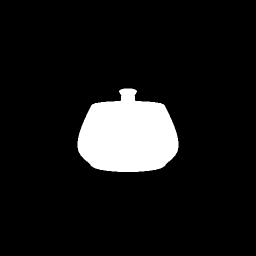

# Neural 3D Mesh Renderer (CVPR 2018)

This repo contains a Jittor implementation of the paper [Neural 3D Mesh Renderer](http://hiroharu-kato.com/projects_en/neural_renderer.html) by Hiroharu Kato, Yoshitaka Ushiku, and Tatsuya Harada.

It is a port of the [original Chainer implementation](https://github.com/hiroharu-kato/neural_renderer) released by the authors.
Currently the API is the same as in the original implementation with some smalls additions (e.g. render using a general 3x4 camera matrix, lens distortion coefficients etc.). However it is possible that it will change in the future.

The library is fully functional and it passes all the test cases supplied by the authors of the original library.
Detailed documentation will be added in the near future.

## Installation
You can install the package by running
```
pip install neural_renderer_jittor
```
Since running install.py requires Jittor, make sure to install Jittor before running the above command.
## Running examples
```
python3.7 example1.py
python3.7 example2.py
python3.7 example3.py
python3.7 example4.py
```


## Example 1: Drawing an object from multiple viewpoints

<p align="center">

</p>

## Example 2: Optimizing vertices

Transforming the silhouette of a teapot into a rectangle. The loss function is the difference between the rendered image and the reference image.

Reference image, optimization, and the result.


<p align="center">



</p>

## Example 3: Optimizing textures

Matching the color of a teapot with a reference image.

Reference image, result.

<p align="center">

</p>

<p align="center">

</p>

## Example 4: Finding camera parameters

The derivative of images with respect to camera pose can be computed through this renderer. In this example the position of the camera is optimized by gradient descent.

From left to right: reference image, initial state, and optimization process.

<p align="center">

</p>

<p align="center">

</p>

<p align="center">

</p>

## Citation

```
@InProceedings{kato2018renderer
    title={Neural 3D Mesh Renderer},
    author={Kato, Hiroharu and Ushiku, Yoshitaka and Harada, Tatsuya},
    booktitle={The IEEE Conference on Computer Vision and Pattern Recognition (CVPR)},
    year={2018}
}
```
